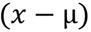

#Mahalanobis Distance

##거리란? 

- 두 기준점이 서로 얼마나 떨어져있는지에 대한 수치.

- 다양한 ( 유클리드, 맨하탄, 마할라노비스) 거리 공식이 존재.

<hr>

###유클리드 거리

- 피타고라스의 삼각형 공식 개념과 동일 하지만, 여러 차원에 대해서의 거리 계산도 가능.


<hr>  

###맨하탄 거리

- 유클리드 거리와 유사하지만, 제곱을 하지 않고 절대값으로 계산.


<hr>  

###마할라노비스 거리

- 유클리드, 맨하탄 거리 공식의 경우 절대적인 거리를 측정할 수는 있지만,   
  만약 서로 다른 데이터가 다른 좌표계( cm 와 km )를 사용한다면 직접적인 비교를 하기 어렵다.   
  물질적인 단위를 가진 데이터끼리의 비교는 쉽지만,정보간의 거리를 나타내기에는 부족하기 때문에   
  이를 해결하기 위해 ‘마할라노비스의 거리’ 개념이 도입된다.
<br>  
  


####마할라노비스 거리 공식 ( Mahalanobis Distance )


   
 input 데이터 (x) – 특징의 평균(μ)

  
( input 데이터 (x) – 특징의 평균(μ) ) 의 전치행렬  
전치행렬 : 행과 열을 교환하여 얻는 행렬.

 
<br>  
<br>
  
공분산 Covariance 의 역행렬


<hr>

####공분산 ( Covariance )

- 두 개의 확률 변수의 선형관계를 나타내는 값으로, 예를들어, 어떤 변수(x)가 평균으로부터 증가 또는 감소라는 경향을 보일 때, 이러한 경향을 다른 변수(y)가 따라 하는 정도를 수치화 시킨 것.

- 아래 공식을 통해서 3 가지 경우를 나눌 수 있다.

| CASE    |  설명 | 
| :----- |  :--- |
| COV( x, y ) > 0  | 두 확률변수 x,y 는 서로 양의 선형 관계     |
| COV( x, y ) < 0  | 두 확률 변수 x, y 는 서로 음의 선형 관계   |
| COV( x, y ) = 0  | 두 확률 변수 x, y 는 서로 상관 관계가 없다  |

<br>

####공분산 공식


( x 의 편차 ) * ( y의 편차 ) 들의 기댓값( Expected Value )

<hr>

#### 공분산을 지원하는 Python 패키지
```python  
# Sklearn LedoitWolf 
from sklearn.covariance import LedoitWolf

class sklearn.covariance.LedoitWolf ( *, store_precision=True, assume_centered=False, block_size=1000)

    # store_precision : bool , default = True
    # -precison (정밀도) 값을 저장할지 여부
    
    # assume_centeredbool: bool , default = False
    # - True 일 경우, data 는 중앙으로 집중되지 않는다.
    # - False 일 경우, data 는 중앙으로 집중된다.
    
    # block_size : int, default=1000
    # - Ledoit-Wolf 연산을 위해 covariance matrix 를 몇개의 블록으로 나눌지.
    # - memory 최적화와 관련이 있고, 연산 결과에는 영향이 없다.

# Numpy 
import numpy

numpy.cov( m, y=None, rowvar=True, bias=False, ddof=None, fweights=None, aweights=None, *, dtype=None )

    # m : array 
    # - 1,2 차원의 배열
    
    # y : array ( optional )
    # - m배열과 같은 형태로, 추가적인 변수 값
    
    # rowvar : bool 
    # - True : row는 변수  , column 은 관측치
    # - False: row는 관측치, column 은 변수
    
    # bias : bool
    # - False : N - 1 로 normalization ( N 은 주어진 변수의 개수)
    # - True  : N 으로 normalization
    
    ... ( 생략 )
    
```

