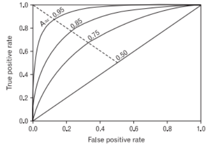
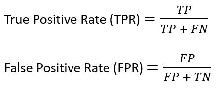
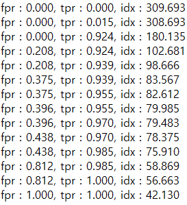

#**ROC curve**
<hr>
<hr>


##**ROC curve ( Receiver Operating Characteristic curve)**

- FPR, TPR 을 각각 x축, y 축으로 놓은 그래프.

- x, y 둘다 범위는 0 ~ 1 사이.

- ROC 커브는 면적이 1에 가까울수록 좋은 성능. ( 항상 0.5 ~ 1 사이의 값을 가지고, 0.5 는 랜덤한 경우, 0.5 보다 작은 값인 경우에는 랜덤하게 적용하는 것보다 성능이 안나온다는 뜻)

- 이진 분류기의 성능을 표현하는 커브.



<hr>


##**TPR, FPR** 

FPR : Fasle Positive rate ( x축)

TPR : True Positive rate ( y축)

- 공통으로 들어가는 positive 는 판단자 기준으로 ‘그렇다‘ 라고 판별했다는 뜻.

- True, False 는 ‘판단을 올바르게 했다’ 와 ‘판단을 틀리게 했다’ 	
<hr>  

##**TPR, FPR 공식**



###Confusion Matrix 종류

| 이름    | 용어설명     | 상세설명 | 
| :----- | :-------: | :--- |
| TP (True Positive)  | 진성불량  | ‘불량’으로 판정한 사실이 맞은 경우 ( 진짜 불량)       |
| FP (False Positive)  | 가성불량 | ‘불량’으로 판정했지만 사실이 아닌 경우 ( 가짜 불량)    |
| FN (False Negative)  | 미검  | ‘양품’으로 판정한 사실이 아닌 경우 ( 불량으로 검출했어야 하지만 하지 못한 경우)   |
| TN (True Negative)   | 양품  | ‘양품’으로 판정한 사실이 맞은 경우 ( 진짜 양품)  |


- Positive :  ‘불량’ 으로 판정.

- Negative : ‘양품’ 으로 판정

- True, False: Positive or Negative 판정을 기준으로 참인지 거짓인지. 

<span style="color:red">TPR 은 1 에 근접할수록 ( 미검출이 없다는 뜻 = TP 값이 크다. ) 좋다. </span>

<span style="color:red">FPR 은 0 에 근접할수록 ( 과검출이 없다는 뜻 = FP 값이 작다. ) 좋다. </span>

<hr>

##ROC Curve 적용법 

- Sklearn 에 roc_curve 함수가 존재.  
```c++  
def roc_curve (y_true , y_score, *, pos_label=None, sample_weight=None, drop_intermediate=True )
```
참조 : <https://scikit-learn.org/stable/modules/generated/sklearn.metrics.roc_curve.html>

| <span style="color:red">Input</span> Parameter    | type     | 설명 | 
| :----- | :-------: | :--- |
| y_true  | ndarray  | 실제 class 값 array ( classification 기준으로 0 or 1 값)       |
| y_score  | ndarry | 모델을 통해서 나온 Target 의 score 값.   |

| <span style="color:red">Return</span> Parameter    | type     | 설명 | 
| :----- | :-------: | :--- |
| fpr  | ndarray  | 예측값의 false positive rate 값들을 가진 배열      |
| tpr  | ndarry | 예측값의 true positive rate 값들을 가진 배열  |
| threshold  | ndarry | threshold 값 배열  |


- roc_curve 함수 결과값 예시 




<hr>

##ROC AUC score

ROC AUC : ROC 곡선의 아랫부분 면적
- Sklearn 에 roc_curve 함수가 존재.  
```c++  
def roc_auc_score ( y_true, y_score, *, average='macro', sample_weight=None, max_fpr=None, multi_class='raise', labels=None)
```
참조 : <https://scikit-learn.org/stable/modules/generated/sklearn.metrics.roc_auc_score.html>

| <span style="color:red">Input</span> Parameter    | type     | 설명 | 
| :----- | :-------: | :--- |
| y_true  | ndarray  | 실제 class 값 array ( classification 기준으로 0 or 1 값)       |
| y_score  | ndarry | 모델을 통해서 나온 Target 의 score 값.   |

| <span style="color:red">Return</span> Parameter    | type     | 설명 | 
| :----- | :-------: | :--- |
| auc  | float  | ROC AUC 결과 값      |


